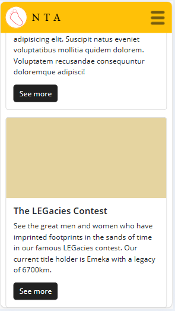
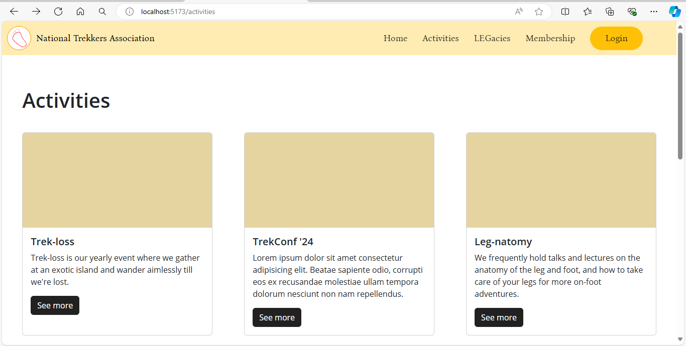

**24th June, 2024**

I created the Activities page using Bootstrap's card templates. I also made sure the page was fully responsive.

## Problems so far

While doing the task, I found that the footer was not at the bottom of the page. It moved up, creating a white space between the footer and the bottom of the page. So, I created a new div and set it to display flex, flex-direction to column and the contents justification to space between so that the footer stay at the bottom, the other content stay in the middle, and the page title stay on top. It worked.

## Next tasks
- [x] Create and add the footer.
- [ ] Create a banner to notify the viewer that the historical information in the page are totally made up.
- [x] Integrate footer with remaining pages.
- [ ] Make the link for the current page to be orange.